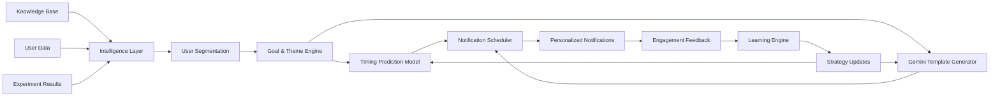

# Project Aurora

## Self-Learning Notification Orchestrator

### AI-Powered User Engagement Personalization System

Aurora is a notification orchestration platform that personalizes user communication using behavioral analytics, machine learning, and large language models.

The system analyzes user activity patterns, groups users into behavioral segments, predicts optimal notification timing, generates personalized bilingual notification templates, and continuously improves communication strategies using engagement feedback.

Although developed using SpeakX (an AI-powered English learning platform) as the reference domain, Aurora is designed to be domain-agnostic and can be adapted to other applications by replacing the knowledge base and user behavior dataset.

# Problem Statement

Traditional notification systems rely on static rules such as:

Send a reminder after 3 days of inactivity
Send notifications to all users at a fixed time
Use the same message for every user

Such approaches ignore differences in user behavior, motivation, and engagement patterns, often leading to notification fatigue and reduced effectiveness.

Aurora addresses this problem by answering four key questions:

Which users should receive notifications?
What type of message should be sent?
When should the notification be delivered?
How should the strategy improve based on user feedback?

# System Architecture

# Core Components
## 1. Data Processing Layer

Responsible for preparing user and business data for downstream analysis.

Inputs
Company Knowledge Base
User Behavioral Dataset
Experiment Results
Processing
Schema validation
Missing value handling
Deduplication
Feature transformation
Dataset merging
Output

A structured dataset suitable for segmentation and machine learning tasks.

## 2. User Segmentation Engine

Users are grouped according to behavioral characteristics rather than treated as a single population.

Behavioral Signals
Session frequency
Exercises completed
Notification responsiveness
Streak consistency
Feature usage patterns
Motivation indicators
Example Segments
Streak Champions
Rank Chasers
Habit Builders
Struggling Learners

Segmentation enables the system to design communication strategies that align with different user motivations.

## 3. Goal & Communication Strategy Engine

Each segment is assigned:

Engagement goals
Communication objectives
Motivational themes

The system uses the Octalysis behavioral framework to determine suitable messaging approaches.

Communication Themes
Accomplishment
Ownership
Social Influence
Scarcity
Loss Avoidance

These themes help align notifications with user motivations.

## 4. Notification Timing Optimizer

Aurora predicts the most effective notification window for each user.

Features Used
Sessions in last 7 days
Exercises completed
Current streak
Motivation score
Activeness score
Churn risk
Lifecycle stage

### Models Evaluated

To predict the optimal notification delivery window, multiple machine learning models were benchmarked and compared.

| Model | Role in Evaluation |
|--------|-------------------|
| **Random Forest** | Ensemble-based classifier capable of modeling complex non-linear behavioral patterns. |
| **Gradient Boosting** | Sequential ensemble method designed to improve prediction accuracy on structured tabular data. |
| **Logistic Regression** | Lightweight and interpretable baseline classification model. |
| **Support Vector Machine (SVM)** | Margin-based classifier used to identify optimal class boundaries in feature space. |

Model selection was performed using Accuracy, Macro F1-Score, and Cross-Validation Accuracy to ensure both predictive performance and robustness on unseen data.

Output

For every user, the system predicts:

Top 3 notification windows
Engagement probabilities
Segment-level timing preferences

## 5. Notification Template Generator

Aurora generates personalized notification templates using Gemini.

Templates are generated using:

User segment information
Lifecycle stage
Communication goals
Behavioral themes
Output Structure

Each template contains:

Title
Body
Call-to-Action (CTA)

Generated in:

English
Hinglish

Example:

Title
Keep Your Streak Alive

Body
You're one lesson away from extending your streak.

CTA
Practice Now

## 6. Scheduling Layer

Combines:

User segment
Predicted timing
Generated templates

to create personalized notification schedules.

The scheduling system prioritizes engagement while preventing excessive notification frequency.

## 7. Feedback & Learning System

Aurora continuously evaluates communication performance using engagement metrics.

Evaluation Signals
Notification opens
Session starts
Exercise completions
Streak continuation

## Strategy Classification

Aurora evaluates notification strategies using engagement signals collected from user interactions. Each strategy is classified based on its observed performance and is subsequently assigned an appropriate traffic allocation.

### Evaluation Signals

- Notification Open Rate
- Session Starts
- Exercise Completions
- Streak Continuation
- Overall Engagement Reward

### Classification Categories

| Classification | Description | Action |
|---------------|-------------|---------|
| **GOOD** | Consistently generates strong engagement and positive user response. | Prioritize and increase traffic allocation. |
| **NEUTRAL** | Produces moderate engagement with inconclusive performance. | Continue testing and generate alternative variants. |
| **BAD** | Shows low engagement or poor user response. | Reduce exposure and replace with improved strategies. |

### Traffic Allocation Policy

| Strategy Class | Allocation |
|---------------|------------|
| **GOOD** | 70% |
| **NEUTRAL** | 25% |
| **BAD** | 5% |

This feedback-driven mechanism allows Aurora to gradually shift traffic toward higher-performing notification strategies while maintaining sufficient exploration for continuous improvement.

Technologies Used
Machine Learning
Scikit-Learn
Pandas
NumPy
SciPy
Large Language Models
Gemini 2.5 Flash
Development Tools
Python
Joblib
Requests

Key Features
Behavioral user segmentation
Personalized notification timing prediction
Bilingual notification generation
Feedback-driven optimization
Domain-agnostic architecture
Machine learning based personalization
LLM-powered content generation
Scalable modular pipeline

Future Improvements
Online learning models
Contextual bandits
Real-time A/B testing
Deep personalization models
Real-time notification delivery infrastructure
Multi-language support beyond English and Hinglish

Conclusion

Aurora is a self-learning notification orchestration system that combines behavioral analytics, machine learning, and generative AI to improve user engagement.

By understanding user behavior, predicting optimal notification timing, generating personalized content, and adapting based on engagement feedback, Aurora transforms traditional rule-based notifications into an intelligent and continuously improving communication system.
